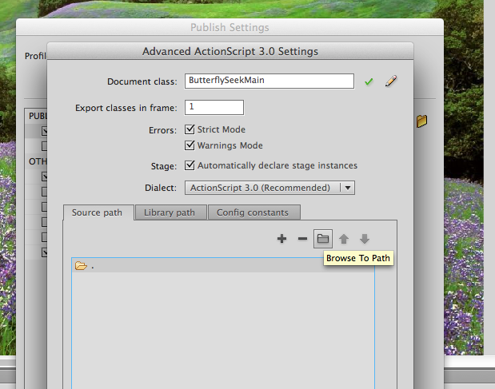
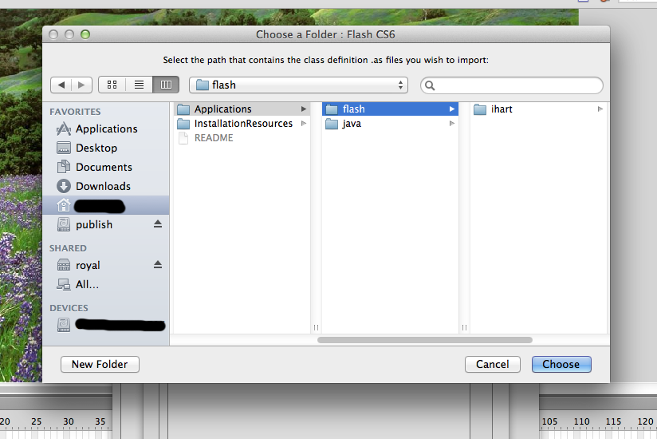

# Running iHart Applications

First, run the iHart application. A full explanation of the software can be found [here](/software).

To run an application, navigate to the folder containing that application\'s files, 
then run the `.swf` file (OSX or Windows), or the `.app` file (OSX). 
The demo applications are in \"Applications -> flash -> ihart -> demo\".

If the applications won\'t run, you\'re getting errors, or it seems like the application isn\'t
sensing motion, try the below suggestions.

### Type was not found or was not a compile-time constant: CVEvent
This is caused by the fact that the application can\'t find the files containing the CVEvent class definitions.

To fix this, open the `.fla` file associated with the application, and go to \"File -> Publish Settings\".
There will be a little wrench-shaped icon next to \"Script: ActionScript 3.0\". Click it.

This brings up a window of advanced settings. Click on \"Source Path\", 
and then the folder icon that will let you \"Browse To Path\".

Browse to the \"Applications -> flash \" folder, and hit \"Choose\" to add it as a source path.
Save and re-publish your application, and you shouldn\'t get the above error anymore.

### Other errors

More can be found [here](https://sites.google.com/a/mtholyoke.edu/the-care-and-keeping-of-ihart/developer-resources/troubleshooting)

They will be re-documented here later.

# Creating iHart Applications
To create an iHart program proceed as you would when creating a Flash game or interactive scene. 
Prepare your program by creating an interactive scene or game in flash and saving it in .fla file, 
any action script code needed to make the scene functional should be saved in .as file. 
Just as you would make your game or scene interactive by adding mouse event listeners, 
you will now do the same be creating cvEvent listeners.

First, you will need to import the appropriate iHart libraries along with any other libraries you might need:

    import flash.events.*;
    import ihart.event.*;

Next, you will have to set up some global variables:

    private var hostName:String = "localhost"; //the host name will generally be localhost
    
    //if you are intending to display your application in the hallway the host name will have to be initialized like this:
    //private var hostName:String = "192.168.10.1";

    private var port:uint = 5204; // the port number is 5204

    private var cvManager : CVManager; //cvManager will handle our CVEvents

In your constructor initialize your cvManager and add an event listener to it:

    cvManager = new CVManager(hostName, port);
    cvManager.addEventListener(CVEvent.SHELL, getData);

Now you are done with the initial set up and in you getData function you can write code that will save the data about the users movements
and react to them appropriately. To find out more about the obtained data about the users movement, refer to the cvServer documentation.
If you are having trouble compiling your program, go to the Troubleshooting page to see some of the most common errors and how to deal
with them.