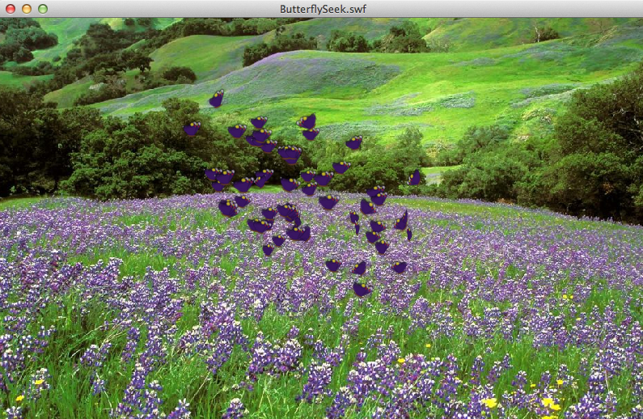
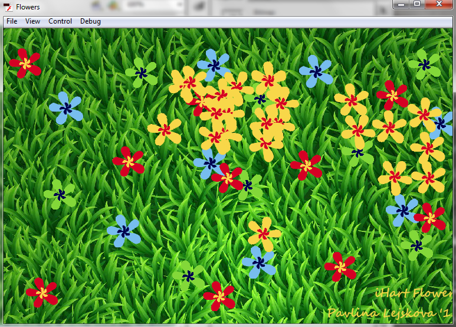
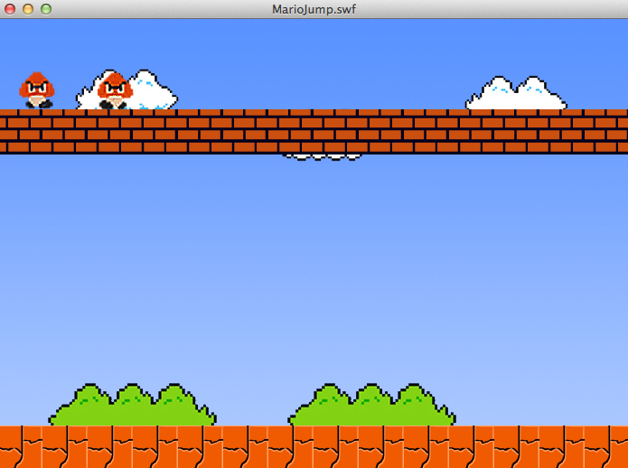
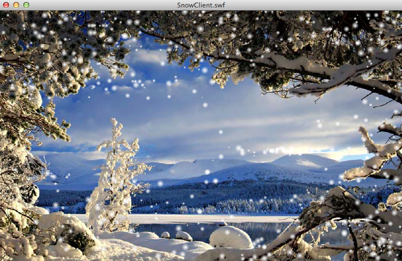
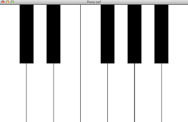
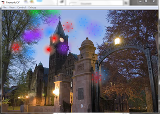

# Application Development
* [Current Applications](##Examples of Current iHart Applications)
* [Guides](##Creating iHart Applications)
* [Source Code](https://github.com/ihart-mhc/ihart)

## Examples of Current iHart Applications
Bellow, you can find a list of previously created iHart applications for inspiration. The source code for all of these applications can be downloaded from [GitHub](https://github.com/ihart-mhc/ihart).

### Butterfly
In this applications butterflies follow the motion of the user and cluster together.

### Flowers
In this applications flowers grow around the areas where movement is detected.

### Mario Jump

### Snow Scene
In this application the snowflakes fall around the areas outlined by user\'s motion.

### Piano
In this application, the user can play the piano by creating motion in front of the proper keys.

### Fireworks
In this application, fireworks explode around the areas where movement is detected.

## Creating iHart Applications
To create an iHart program proceed as you would when creating a Flash game or interactive scene. Prepare your program by creating an interactive scene or game in flash and saving it in .fla file, any action script code needed to make the scene functional should be saved in .as file. Just as you would make your game or scene interactive by adding mouse event listeners, you will now do the same be creating cvEvent listeners.

First, you will need to import the appropriate iHart libraries along with any other libraries you might need:

    import flash.events.*;
    import ihart.event.*;

Next, you will have to set up some global variables:

    private var hostName:String = "localhost"; //the host name will generally be localhost
    
    //if you are intending to display your application in the hallway the host name will have to be initialized like this:
    //private var hostName:String = "192.168.10.1";

    private var port:uint = 5204; // the port number is 5204

    private var cvManager : CVManager; //cvManager will handle our CVEvents

In your constructor initialize your cvManager and add an event listener to it:

    cvManager = new CVManager(hostName, port);
    cvManager.addEventListener(CVEvent.SHELL, getData);

Now you are done with the initial set up and in you getData function you can write code that will save the data about the users movements
and react to them appropriately. To find out more about the obtained data about the users movement, refer to the cvServer documentation.
If you are having trouble compiling your program, go to the Troubleshooting page to see some of the most common errors and how to deal
with them.
 
